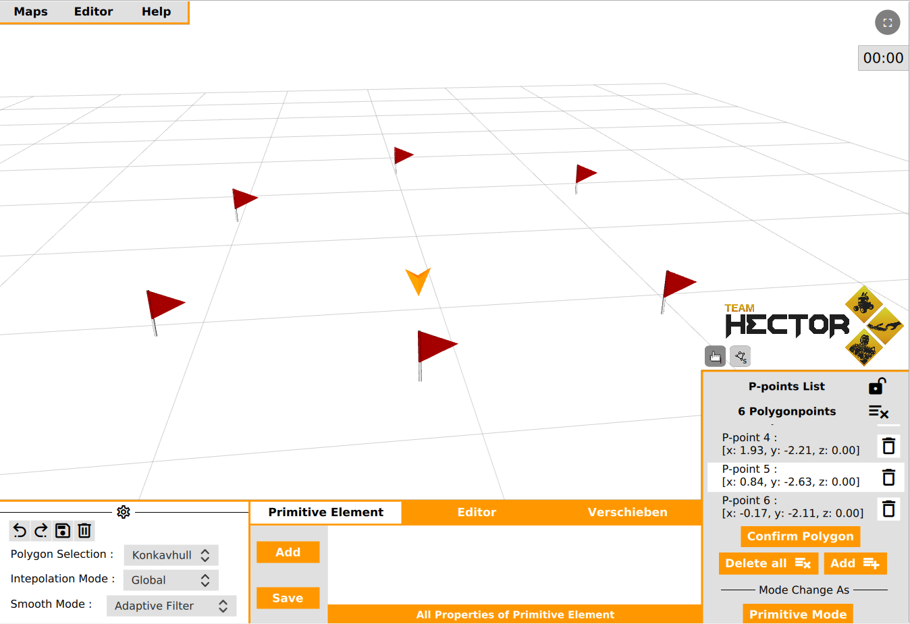
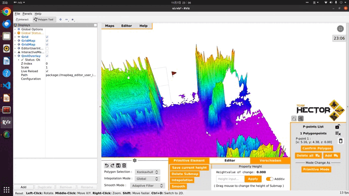
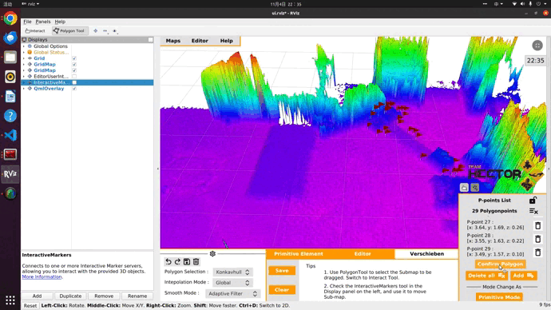
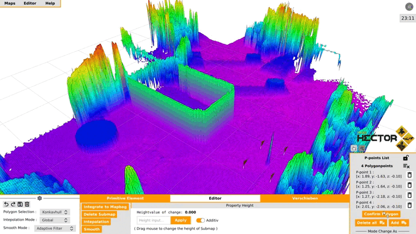

# MapBag Editor User Interface
Maintainer: Yuchen Xia

Refering build section fo setup the package:
- [Build](#build)
- [Prerequisites](#prerequisites)

Rviz plugins package for Userinterface of the MapBag Editor. Currently there are serveral plugins:
- [User_Interface](#user_interface)
- [Polygonpoints_Tool](#polygonpoints_tool)

Following the brief introduction for different functions in the MapBag Editor:
- [Delete Subamp](#delete-subamp)
- [Setting the height value](#setting-the-height-value)
- [Move Submap](#move-submap)
- [Add Primitive Element](#add-primitive-element)
- [Smooth Submap](#smooth-submap)
- [Interpolate Subamp](#interpolate-subamp)
- [Undo/Redo](#undo/redo)

**Important Tip:**

**Don't forget to click on "Confirm Polygon" to generate a Submap before using any editing functions !!!**

## Build
Clone package `mapbag_editor_user_interface` to your workspace:

```
cd <your_workspace>/src
git clone https://...
cd ..
hector make mapbag_editor_user_interface
source <your_workspace>/devel/setup.bash
```
## Prerequisites
It requires an MapBag Editor Server node when editing maps.

## User_Interface
Intuitive MapBag Editor for creating, editing and visualizing synthetic elevation maps.


1. __Editor Menu__

The "Editor menu" allows you to complete import and export processes for maps and delete the current map. 
The Editor user interface can also be hidden or displayed via the menu. 

2. __Systemsettings__

The "System settings" allow you to customize specific settings in the editor, such as the mode in which the editor_server selects polygon submaps, the type of interpolation operations or smoothing operations of submaps. 

3. __Control Panel__

Various editing operations can be carried out via the "Control Panel", such as deleting, interpolating or moving sub-maps. 

4. __Display Panel__

The "Display Panel" shows information about the used plug-in tool . 

5. __Interactive Marker__

In addition, the editor has an interactive marker that allows you to move sub-maps.

## Polygonpoints_Tool
The plug-in tool integrates seamlessly into the RViz user interface and allows the user to create, edit and delete polygon vertices directly. These points are used to define polygon target sub-maps. 



1. __PolygonPoint Tool__

The RViz PluginTool is used to determine the vertices that define the polygonal sub-map.
By clicking on the toolbar, the PluginTool is activated and the user can define the corner points.

2. __Liste der PolygonPunkte__

The list in the "Display Panel" shows the 3D coordinates of the individual points. 
Using the buttons provided, the user can perform actions such as adding or removing individual points. 
A "Delete All" button allows the user to delete all points at once.

3. __Punkt Marker__

When the user clicks on any polygon point in the list, the editor visualizes this with an arrow marker indicating which polygon point is currently being edited.

## Delete Subamp


## Setting the height value


## Move Submap


## Add Primitive Element


## Smooth Submap

## Interpolate Subamp


## Undo/Redo



